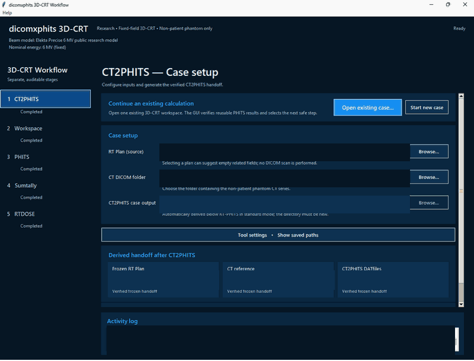

# dicomxphits

dicomxphits is an education and research workflow for preparing strict
fixed-field 3D-CRT PHITS inputs from DICOM RT Plans and for controlling the
explicit PHITS, Sumtally, RTDOSE, coordinate-correction, and external GPR
handoff stages.

Within its documented non-patient phantom scope, this repository is a working
public implementation of that complete chain rather than only a proposal that
the interfaces might be connected. It provides a bounded engineering
demonstration—a constructive proof of feasibility—for an openly inspectable
and modifiable DICOM-to-PHITS-to-RTDOSE research workflow.

It is not clinical commissioning, patient QA, vendor certification, or a
substitute for independent clinical validation. Real patient DICOM, licensed
tool distributions, and real-tool outputs must remain outside this repository.

## Start Here

This README is the public entry point, not the complete technical specification.
Choose the path that matches your purpose:

- **First-time Windows research users** — start with
  [Windows GUI Quick Start](#windows-gui-quick-start), then follow the
  [GUI User Guide](docs/gui-user-guide.md).
- **Researchers reviewing scope and evidence** — read
  [What This Repository Demonstrates](#what-this-repository-demonstrates),
  [Built-In Public Research Model](#built-in-public-research-model), and the
  [Public Feasibility Demonstration](docs/public-feasibility-demonstration.md).
- **CLI users and maintainers** — use the
  [CLI and Technical Reference](docs/cli-reference.md) for complete commands,
  provenance gates, dose semantics, coordinate handling, and recovery rules.
- **Non-patient phantom CT derivation** — use the
  [Phantom CT Water Replacement Guide](docs/phantom-ct-water-replacement.md)
  for the standalone, explicitly invoked CLI that creates a new calculation-
  only CT series from target and clean-water RTSTRUCT ROIs without overwriting
  the source CT. It is not exposed in the GUI or run by the guided workflow.
- **Contributors** — use the
  [development guidance](docs/development.md) and current specifications under
  `openspec/specs/`.

All paths retain the same education-and-research-only boundary stated above.

## Status

Version 1.0.3 includes standalone public adapters for strict 3D-CRT workspace
preparation, PHITS segment execution, Sumtally generation and execution,
RTDOSE conversion and coordinate correction, and an optional external
GPR-comparing handoff. See the [v1.0.3 release notes](docs/release-notes-v1.0.3.md)
for the changes since v1.0.2.

The current public release is
[`v1.0.3`](https://github.com/inata169/dicomxphits/releases/tag/v1.0.3). It is
published without a custom Windows offline ZIP. The v1.0.2 custom offline ZIP
was withdrawn and removed after a later endpoint-protection compatibility
failure and should not be used. The v1.0.2 tag, GitHub Release, source archives,
and historical artifact identity remain recorded in its
[release notes](docs/release-notes-v1.0.2.md).

## Supported Environment

The supported use depends on the host environment. Installing the Python
package on a platform does not by itself mean that the complete external-tool
workflow is supported there.

| Environment | Documented use | Important boundary |
| --- | --- | --- |
| Windows host with Python 3.12 | Guided desktop GUI and the public CLI adapters, including the Windows CT2PHITS frontend and explicitly authorized real-tool workflow | The supplied GUI launcher and `RTphits_win.bat` adapter are Windows-only. Licensed external tools and confirmed non-patient inputs remain user-supplied and outside this repository. |
| Linux or the project Dev Container | Python 3.12 development, synthetic/mock tests, CLI validation, and the public-tree audit | The Dev Container is not a real-tool runtime. It does not support the Windows CT2PHITS frontend or the supplied PowerShell GUI launcher. |
| GitHub Actions on Ubuntu and Windows | Python 3.12 synthetic/mock compilation, tests, and public-tree validation | CI does not run PHITS, RT-PHITS, CT2PHITS, Sumtally, phits2dicom, GPR, or real DICOM. |
| macOS | Outside the v1 support range | Package installation or partial Python execution must not be interpreted as support for the guided workflow or external tools. |

The documented guided GUI workflow is therefore a Windows-host workflow. The
repository's Linux Dev Container is a separate development and validation
environment; its Python installation does not create the Windows host
`.venv` required by the launcher. Python 3.12 is the only supported Python
runtime for v1. Python 3.11 and earlier and Python 3.13 and later are outside
the v1 support range; this statement does not claim that every later version
is technically incapable of running any part of the package.

## Windows GUI Quick Start

For a first-time user, the initial goal is to verify Python 3.12, install the
package, launch the GUI, and understand the gated workflow. It is not a promise
that an external PHITS calculation will finish within five minutes. Real-tool
execution additionally requires separately obtained licensed tools, a confirmed
non-patient phantom, and calculation time appropriate to the selected controls.

On a Windows host, run the following commands from the repository root in
PowerShell. Do not run this launcher from the Linux Dev Container terminal.

```powershell
py -3.12 --version
py -3.12 -m venv .venv
.\.venv\Scripts\python.exe -m pip install -e .
.\launchers\run_gui_venv.cmd
```

Confirm that the first command reports Python 3.12. If the Python launcher is
unavailable, use `python --version` only when it reports Python 3.12, then run
`python -m venv .venv`. The `.cmd` launcher is the default Windows entry point
because it is not governed by PowerShell's `.ps1` script execution policy. It
adds the repository-local `.venv\Scripts` directory to the child process PATH
and starts the GUI with that environment's Python.

The equivalent PowerShell launcher remains available where local policy allows
unsigned repository scripts:

```powershell
.\launchers\run_gui_venv.ps1
```

If PowerShell reports `PSSecurityException` or says that the downloaded script
is not digitally signed, keep the machine or organization execution policy in
place and use `run_gui_venv.cmd`. Neither launcher creates an environment,
installs dependencies, or reuses the Dev Container's Linux Python. See
[Guided Desktop GUI](#guided-desktop-gui) for tool setup and case-path behavior.
For the complete v1.0.x walkthrough, see the
[GUI User Guide](docs/gui-user-guide.md).

After the GUI opens:

1. Open **Tool settings**, select the licensed **PHITS installation folder**,
   and choose **Validate and save setup**.
2. Select the RT Plan and CT folder for a confirmed non-patient phantom.
3. Follow the visible sequence: CT2PHITS, Workspace Prepare, PHITS, Sumtally,
   and RTDOSE. Each external stage remains explicit and gated.

## Windows Offline Installation

The v1.0.3 GitHub Release does not include a public Windows offline ZIP. A
locally built v1.0.3 bundle passed bounded human installation and GUI-startup
checks, but behavior-based endpoint protection blocked the verified
uninstaller. The candidate was therefore not accepted as a public release
asset. Do not disable endpoint protection or exclude system PowerShell to work
around this limitation.

The v1.0.2 custom offline ZIP used the same relevant installer and uninstaller
implementation and was withdrawn and removed from its GitHub Release. The
v1.0.2 tag, GitHub Release, and source archives remain available, but the custom
ZIP should not be used or redistributed.

The repository retains the bundle builder for maintainer evaluation; its
output is not a v1.0.3 public release artifact. A future public offline asset
requires a newly reviewed exact-HEAD bundle and a successful complete
install/launch/verified-uninstall lifecycle under the intended endpoint
protection environment.

For controlled maintainer evaluation only, an online Windows 10/11 x64
computer can create a candidate bundle with:

```powershell
.\tools\prepare_offline_bundle.ps1
```

During that controlled maintainer evaluation, the offline-computer procedure
is:

1. Copy and fully extract the ZIP to a writable local-disk folder.
2. Run `install_offline.cmd` from the extracted folder.
3. Approve the Windows administrator prompt for the verified installation
   stage.

The installer verifies the bundle before requesting elevation, uses elevation
only to construct its authenticated Python runtime in protected storage,
creates the repository-local `.venv`, uses only bundled wheels, verifies the required
imports, and offers the existing GUI launcher after success. Denying elevation
stops before Python starts. It does not bundle, discover, or run PHITS-related
external tools. These steps do not make the candidate a public or supported
release asset. See the complete maintainer-evaluation boundary in the
[English offline installation guide](docs/windows-offline-installation.md)
or [Japanese offline installation guide](docs/windows-offline-installation.ja.md).
The bounded 2026-08-07 human check is recorded in the
[Windows offline installation validation record](docs/windows-offline-installation-validation-2026-08-07.md)
([Japanese](docs/windows-offline-installation-validation-2026-08-07.ja.md));
it is installation evidence, not clinical validation.

## Workflow at a Glance



The animation shows the guided staged workflow with local paths and identifiers
redacted.

The guided workflow keeps each stage explicit and gated:

1. **CT2PHITS** — on Windows, `dicomxphits-run-ct2phits` invokes the
   user-supplied `RTphits_win.bat` for a confirmed non-patient phantom; it never
   calls `ct2phits_win.exe` directly.
2. **Workspace Prepare** — validate the frozen handoff and prepare strict
   fixed-field 3D-CRT PHITS inputs.
3. **PHITS** — explicitly run every active segment.
4. **Sumtally Generate / Run** — generate and explicitly execute the
   all-active-segments totalfield Sumtally job.
5. **RTDOSE Prepare / Run** — prepare conversion, invoke phits2dicom, and apply
   the validated coordinate-correction handoff.
6. **Optional GPR** — execute the external comparison or record an explicit
   knowledge-based skip.

## What This Repository Demonstrates

The public adapters implement the path from non-patient phantom DICOM CT and
RT Plan inputs, through the user-supplied CT2PHITS handoff, fixed-field 3D-CRT
PHITS input generation and segment calculation, Sumtally dose aggregation,
DICOM RT Dose conversion and coordinate correction, to an external
GPR-comparing comparison using a TPS-derived RT Dose as the reference and the
coordinate-corrected PHITS-derived RTDOSE as the evaluation.

Two bounded non-patient phantom cases have been confirmed by the author to
complete this end-to-end workflow: a centered `20 × 20 cm²` field on a water
phantom and a case using the PHITSgeoTest plan. A read-only review of four
locally retained comparison reports and their run logs mapped one record to
PHITSgeoTest, two records to the same centered water-phantom case, and one
record to a separate non-patient phantom. The PHITSgeoTest case produced a
Gamma Passing Rate of at least 95%. The two centered water-phantom records
produced values around 95%, slightly below 95% in both records.

All four records used global `3% / 3 mm` gamma with a `10%` dose cutoff,
global-maximum normalization, linear interpolation, and an interpolation
fraction of 3. A separate non-patient phantom record also produced a passing
rate of at least 95%. The available evidence for that record establishes the
comparison outcome, but not the human-confirmed completion of the full chain
used to define the two demonstrated cases, so it is retained only as supporting
comparison evidence. Exact individual pass rates, external paths, identifiers,
and result files are not published.

This is a working end-to-end demonstration within a deliberately narrow
research scope. It demonstrates that the public implementation and external
tool handoffs can be made operational; it does not demonstrate clinical
accuracy, commissioning, general machine compatibility, or suitability for
patient QA. The reported Gamma Passing Rates are research observations, not
clinical acceptance thresholds or QA decisions. See
[Public Feasibility Demonstration](docs/public-feasibility-demonstration.md)
for the evidence and reproducibility boundaries.

## v1.0.x Workflow

The v1.0.x workflow is intentionally narrow:

- strict 3D-CRT RT Plan input
- strict MU gate before downstream stages
- generated PHITS input workspace through public adapters
- explicit PHITS execution stage
- explicit Sumtally generation and execution stage
- explicit RTDOSE conversion stage

Each stage must write command metadata, return code when executed, stdout and
stderr capture paths or content, major input and output paths, and a summary JSON
path.

## v1.0.x Supported Scope

For v1.0.x, dicomxphits supports fixed-field 3D-CRT up to the centered
`20 × 20 cm²` effective-aperture boundary for education and research. After
DICOM Control Point inheritance is resolved, the jaw and MLC common effective
aperture at every Control Point must remain inside the closed collimator-local
isocenter-plane box from `-100.000 mm` to `+100.000 mm` on both X and Y. Each
effective width must also be no greater than `200.000 mm`.

Only coplanar plans are supported (`コプラナーのみ対応`): the patient
support/couch angle must be zero. The public v1 runtime rejects nonzero couch
angles.

A centered `20 × 20 cm²` aperture is therefore the largest square at the
boundary. A narrower offset aperture is eligible only when every effective
point remains inside the same box. The workflow rejects overruns rather than
clipping, recentering, or expanding the source cone.

The v1 scope is fixed-field 3D-CRT only. IMRT, dynamic MLC delivery, and VMAT
are outside the supported scope.

This narrow initial boundary was selected for a maintainable education and
research workflow with Monte Carlo computational cost in mind. It is not based
on an estimate of clinical field-frequency distribution.

### Tested DICOM Environment

The DICOM RT files used to test this repository were exported by Elekta Monaco
6.2.2:

- RT Plan (`RTPLAN`)
- RT Dose (`RTDOSE`)
- RT Structure Set (`RTSTRUCT`)

The tested DICOM CT files identify the following scanner:

- Manufacturer (`0008,0070`): `GE MEDICAL SYSTEMS`
- Manufacturer's Model Name (`0008,1090`): `Discovery RT`

These values record the environment originally documented for v1.0.0. They do not
claim validation or guaranteed compatibility for other TPS versions, treatment
machines, or CT scanners. The runtime does not reject an input solely because
these identifying DICOM values differ.

Elekta's public
[Infinity brochure](https://www.elekta.com/products/radiation-therapy/infinity/assets/Infinity-Brochure.pdf)
describes Agility leaves across a full `40 × 40 cm²` device field. That is a
cited hardware specification only. It is outside the dicomxphits v1.0.x
software scope and is not supported behavior.

Technical references to Elekta, Agility, Monaco, IAEA, PHITS, or other product
and organization names identify provenance or interfaces only. They do not
imply affiliation, endorsement, certification, or comprehensive compatibility.

## Built-In Public Research Model

The default workspace preparation uses a deliberately simplified built-in
public research model:

- a uniform `3 × 3 mm` rectangular photon source centered in a beam-aligned
  source plane located `100 cm` upstream of isocenter;
- the bundled 59-bin author-generated spectrum;
- the reviewed rectangular MLC and Y-Diaphragm model, shielding material, and
  PHITS transport settings.

For the supported HFS, couch-zero workflow, DICOM Gantry Angle `g` is rendered
with PHITS beam direction `(sin(g), 0, cos(g))`. Together with the documented
patient mapping `I + 10 * (-x, z, y)`, gantry 90 degrees places the source at
DICOM `+X` and directs the beam toward `-X`; gantry 270 degrees is the opposite.
The source position and accelerator `tr3` transform use this same central axis.

These values were selected and tuned by the repository authors and
collaborators after reviewing literature, manufacturer information, and model
agreement. They are not represented as values copied wholly from one paper,
vendor drawings, facility calibration data, or an exact commissioned clinical
machine. Paschal et al.,
[DOI 10.1002/acm2.13715](https://doi.org/10.1002/acm2.13715), is cited as major
public modeling context rather than as the source of every numeric value.

No machine-configuration file is required for the default. A user-supplied
machine configuration remains an explicit override for research use. Because
the approved factor is bound to the built-in model identity, a changed machine
configuration fails closed as a stale factor unless the caller explicitly
selects `--relative-dose-only`.

## Why a Simplified Public Model Matters

The simplification is an intentional trade-off. The built-in source, spectrum,
rectangular MLC and Y-Diaphragm geometry, materials, and transport settings can
be inspected, discussed, and modified without vendor-confidential machine
drawings, NDA-protected information, facility-specific commissioning data, or
proprietary Monaco beam-model data. Licensed PHITS and RT-PHITS tools remain
external prerequisites and are not redistributed here.

This openness makes the workflow useful as a research baseline even though the
model does not reproduce a specific clinical Elekta unit, a proprietary
Monaco beam-model configuration, or a commercial treatment-machine digital
twin, and it carries no vendor certification. Its replaceable research-model
components let investigators supply a different configuration and study more
detailed source, MLC, jaw, material, or transport descriptions. A changed
model requires its own calibration and validation; the default dose factor is
deliberately rejected or must be
disabled with `--relative-dose-only`. The value is the public, inspectable
foundation and demonstrated workflow, not a claim that the simplified model
already has clinical-machine fidelity.

## Photon Spectrum Provenance and Dose Calibration

The bundled 59-bin photon spectrum is an author-generated derivative of part 1
of the IAEA `ELEKTA_PRECISE` 6 MV phase-space dataset, identified by
`ELEKTA_PRECISE_6mv_part1.IAEAphsp` and its matching `.IAEAheader`. The source
dataset was prepared by Iwan Kawrakow at the National Research Council of
Canada and was accessed from
[IAEA Nuclear Data Services](https://www-nds.iaea.org/phsp/photon1/) on
2025-08-06. The repository author generated the derivative with PSFC4PHITS,
PHITS, and Sumtally and authorized its neutral inclusion and redistribution.
The original IAEA phase-space and header files remain external and are neither
bundled nor required by the default runtime.

This derivative is an education and research source model. It is not a
commissioned or exact clinical Elekta beam and is not evidence of IAEA, NRC, or
Elekta endorsement.

Source, geometry, material, transport, and spectrum selection are resolved for
the public research default. The model-specific
`totfact_per_MU = 8.7608E+11 source/MU` was derived from the approved public CT
reference calculation and accepted on 2026-07-30. The default runtime writes
that exact value into PHITS inputs only after the machine-model identity
and accepted transport-topology identity match the calibrated public default;
a changed model or stale pre-v5 topology binding is rejected before output is
created. The unchanged numerical factor was reaccepted for corrected v5
topology on 2026-08-31 after human review of repository-safe evidence that the
reference calibration geometry was non-overlapping and transport-equivalent.
No external PHITS dose comparison was performed for that reacceptance. This
education and research calibration carries no clinical commissioning, vendor
certification, or universal clinical-beam claim.

## External Tool Paths

The workflow must keep these paths separate:

- PHITS root folder: used for generated `libpath.inp` `file(1)` values
- PHITS executable path: used for PHITS and Sumtally execution
- phits2dicom executable path: used for RTDOSE conversion

The guided Windows GUI normally derives these separate runtime paths from one
`PHITS installation folder`. Its initial supported standard profile is the
PHITS 3.35-style Windows layout:

```text
<PHITS installation folder>/
├─ bin/phits335_win_openmp.exe
└─ utility/RTphits/
   ├─ RTphits_win.bat
   ├─ data/HumanVoxelTable.data
   └─ bin/phits2dicom_win.exe
```

The standard profile selects the PHITS 3.35 OpenMP executable and the exact
Windows phits2dicom executable. Linux and macOS phits2dicom files distributed
beside it do not create an ambiguity. The GUI checks only these bounded
relative paths and does not run an external tool during setup validation. A
future or nonstandard layout remains usable through the explicit custom-layout
controls; the GUI does not silently fall back to the serial PHITS executable.

No PHITS or RTphits official distribution file is bundled in this tree.
The user's separately obtained licensed installations are external
prerequisites. The optional Windows CT2PHITS frontend requires the user-supplied
`RTphits_win.bat` and `data/HumanVoxelTable.data`; it never invokes
`ct2phits_win.exe` directly. Workspace preparation requires the raw `DATfiles`
directory emitted through that batch path for a confirmed non-patient phantom,
plus one CT DICOM slice
from that same series. These are input data, not bundled software. Supply them
with `--ct-datfiles-root`, `--ct-reference-dicom`, and
`--confirm-non-patient-phantom`. dicomxphits validates the complete raw
CT2PHITS file set, derives the CT origin and RTPLAN isocenter, checks their
Frame of Reference, and prepares the required PHITS include files. Do not
rename `CTuniverse.dat`, `CTvoxel.dat`, or `CTtrans.dat` by hand.
The default does not require Elekta files, an NDA, paid vendor data, facility
geometry or calibration, or the original IAEA phase-space/header files.

## CT2PHITS Frontend Adapter

On Windows, create a new CT2PHITS workspace below the separately supplied
RT-PHITS root and run the verified batch path explicitly:

```powershell
dicomxphits-run-ct2phits `
  --ct-dicom-root <non-patient-ct-directory> `
  --rtplan <non-patient-rtplan.dcm> `
  --rtphits-root <licensed-rtphits-root> `
  --workspace-root <licensed-rtphits-root>/work/<case-id> `
  --timeout-seconds 300 `
  --confirm-non-patient-phantom
```

If the input directory contains multiple CT series, also pass
`--ct-series-instance-uid <uid>`. The stage refuses non-Windows execution,
missing batch/table prerequisites, an existing workspace, failed or timed-out
execution, and pre-existing, missing, or empty outputs. It writes
`ct2phits_workspace_manifest.json`, `ct2phits_execution_summary.json`, captured
logs, the complete nine-file `DATfiles` inventory, and
`prepared_ct_assets/`. The summary records the eight-file raw handoff validated
by `validate_raw_ct2phits_datfiles()` and the coordinate-corrected assets
created by `prepare_ct2phits_assets()`; generated `CTtrans.dat` is inventoried,
while the downstream transform is the validated `CTtrans.inp`.

The generated handoff can then be supplied to the existing workspace adapter.
Reuse the frontend's frozen RT Plan snapshot so the downstream coordinate
transform is derived from the same RT Plan that the frontend validated:

```powershell
dicomxphits-prepare-3dcrt-workspace `
  --rtplan <ct2phits-workspace>/RTPLAN.dcm `
  --workspace-root <new-public-workspace> `
  --phits-root-folder <licensed-phits-root> `
  --phits-executable-path <licensed-phits-executable> `
  --phits2dicom-executable-path <licensed-phits2dicom-executable> `
  --maxcas 1000000 `
  --maxbch 10 `
  --omp-threads 8 `
  --ct-datfiles-root <ct2phits-workspace>/DATfiles `
  --ct-reference-dicom <ct2phits-workspace>/CT/CT000001.dcm `
  --confirm-non-patient-phantom
```

Neither adapter runs PHITS, Sumtally, phits2dicom, or GPR as part of this
frontend stage.

## Guided Desktop GUI

Use the [Windows GUI Quick Start](#windows-gui-quick-start) to create the
Python 3.12 environment and launch the guided Tkinter interface. The details
below describe the guided workflow after launch.

For a new case, the GUI presents CT2PHITS as the first stage, then keeps workspace preparation,
PHITS, Sumtally, and RTDOSE conversion as separate gated actions. After a
successful CT2PHITS run, it automatically passes the frozen `RTPLAN.dcm`,
`CT/CT000001.dcm`, and `DATfiles` paths to workspace preparation. An existing
validated handoff can still be entered from the advanced workspace controls.

After a restart, select **Open existing case…** and choose the existing 3D-CRT
workspace. The GUI verifies the current IEC gantry-geometry contract and
reusable PHITS output digests without external execution, restores one bounded
standard CT2PHITS handoff when available, and
shows the first safe downstream action. **Create DICOM RT Dose** preserves
conflicting downstream material in workspace-local recovery history and runs
only the required Sumtally/RTDOSE suffix. It disables Workspace Prepare and
PHITS for that existing case and never treats an internal missing JSON path as
an instruction to rerun the expensive transport.

For a new case, RTDOSE remains a two-step action. After **Prepare RTDOSE** succeeds, the GUI
shows **Prepared**, disables the prepare action, and makes **Run RTDOSE** the
next available action. Only **Run RTDOSE** invokes phits2dicom and creates the
raw and coordinate-corrected DICOM outputs. **Completed** requires a successful
independent final coordinate-placement validation. Legacy Prepare/Run success
summaries without placement proof are not accepted: the GUI returns to
**Not run**, and explicit Prepare/Run clicks may replace only those legacy
successful summaries. Failed summaries and current evidence keep the normal
overwrite guards. A successful prepare summary must
be reused rather than prepared again. If an upstream Sumtally rerun invalidates
that preparation, explicitly select **Allow overwrite of downstream stage
summaries** to re-enable **Prepare RTDOSE**; the RTDOSE adapter still validates
the new evidence and fails closed if it is inconsistent. The GUI reports
`Completed` only when the Prepare summary is bound to the current Sumtally
evidence and the Run summary records the exact current Prepare-summary digest.
Stale success summaries are retained for audit but do not enable **Run RTDOSE**.

For first-time standard setup, open **Tool settings**, select the licensed
**PHITS installation folder**, and choose **Validate and save setup**. After
that, a normal case requires only the source RT Plan and CT DICOM folder. The
GUI derives a visible new CT2PHITS case output below
`<RT-PHITS root>/work/`; changing the RT Plan or effective RT-PHITS root
replaces the previous derived value instead of retaining a stale workspace.

Selecting an RT Plan may suggest its parent as the CT folder. Explicit CT input
values remain editable, while standard-profile tool paths and CT2PHITS case
output are read-only derived values. The GUI does not recursively scan for
DICOM, search the computer for installations, run setup-time external tools,
or bypass the explicit non-patient confirmation. Use **Custom layout
(advanced)** only when the installed distribution does not match the displayed
PHITS 3.35-style relative layout.

Before **Prepare workspace**, the Workspace page exposes `maxcas` (histories
per batch), `maxbch` (batches), and OpenMP threads. Their defaults are
`1000000`, `10`, and `8`; each must be a positive integer. The selected values
are written only into newly prepared segment inputs and their summaries. They
do not rewrite an existing workspace or change Sumtally settings. The generated
first line remains `$OMP = N`: the dollar sign is official PHITS OpenMP syntax,
not a comment marker. Direct segment execution also passes the same value as
`OMP_NUM_THREADS=N` to the selected OpenMP executable.

The validated profile, stable local tool paths, valid segment runtime
preferences, and each field's most recent Browse directory are saved to the ignored
`config/dicomxphits.gui.local.json` file. The per-case RT Plan, CT folder,
derived CT2PHITS output, non-patient confirmation, and overwrite permission are
never persisted and always start empty or cleared. Existing flat tool settings
are retained as a custom layout unless they match the supported standard
profile. The tracked repository does not contain populated local paths.

The Workspace page also accepts one optional **Calculation config** JSON path.
It changes only the prepared 3D dose tally mesh, is used only by Workspace
Prepare, and is not persisted. Leaving it blank preserves the legacy
101 x 101 x 101, 3 mm tally. See
[Calculation Configuration](docs/calculation-configuration.md) for the schema,
inclusive voxel-centre convention, limits, evidence, and downstream guards.

## Key Files and Directories

This is a selected map of the public tree, not an exhaustive directory listing.

```text
config/
  dicomxphits.calculation.schema.json
  dicomxphits.calculation.example.json
  dicomxphits.machine.schema.json
  dicomxphits.machine.example.json
  dicomxphits.paths.schema.json
  dicomxphits.paths.example.json
docs/
  calculation-configuration.md
  cli-reference.md
  development-handoff-2026-08-07.md
  development-handoff-2026-08-06.md
  gui-user-guide.md
  manual_smoke_workflow.md
  public-feasibility-demonstration.md
  release_acceptance_evidence.json
  windows-gui-launcher-validation-2026-08-06.md
  workflow_stages.md
launchers/
  README.md
  run_gui_venv.cmd
  run_gui_venv.ps1
src/
  dicomxphits/
    public runtime modules
tests/
  README.md
  synthetic and generic regression tests
templates/
  phits2dicom_rtdose_template.dcm
  README.md
```

All runtime adapters are implemented inside the `dicomxphits` package and do
not import from a private repository layout.

## Detailed CLI Reference

The complete Windows PowerShell examples and the detailed provenance,
normalization, recovery, and coordinate contracts are in the
[CLI and Technical Reference](docs/cli-reference.md). Real-tool commands require
separately obtained licensed tools, placeholder paths outside the repository,
and an explicitly confirmed non-patient phantom; they are not Dev Container
commands.

### Prepare Workspace Adapter

The workspace adapter prepares strict fixed-field 3D-CRT segment inputs and
evidence without running PHITS. Segment execution remains a separate explicit
action. An optional calculation configuration may change only the 3D dose tally
mesh; actual segment and Sumtally output geometry remains authoritative.

### Sumtally Adapter

The Sumtally adapters generate and run one MU-weighted,
all-active-treatment-segments totalfield job. The output is not a per-beam
`beamMU` result, and stale or changed inputs fail closed before reuse.

### RTDOSE Adapter

The RTDOSE adapters accept only evidence bound to the same frozen RT Plan,
current Sumtally result, and reviewed geometry contract. The approved public
model factor and active treatment MU are each applied once; the positive
`NumberOfFractionsPlanned` is then applied once to produce
`DoseSummationType = PLAN` course dose in `GY`. Missing, ambiguous, changed, or
stale evidence fails closed.

The final coordinate-corrected output preserves dose values while validating
its frozen-plan reference and patient-coordinate placement. It is absolute dose
only for the defined public education and research reference model. It does not
claim clinical commissioning, universal machine `Gy/MU` accuracy, vendor
certification, or agreement with a physical treatment unit.

### GPR-comparing Handoff

[GPR-comparing](https://github.com/inata169/GPR-comparing) remains an optional
external research tool and is not bundled. Its handoff verifies compatible
RTDOSE inputs, records the selected gamma criteria and fresh result, and makes
no clinical-validity or acceptance-threshold claim.

### Advanced and Maintenance Commands

`dicomxphits-prepare-ct-calibration` prepares the explicit CT calibration
workflow; it is not part of the normal guided case sequence.
`dicomxphits-fix-rtdose-coordinates` exposes the standalone RTDOSE coordinate
correction operation for controlled maintenance or investigation. The normal
RTDOSE Run stage performs its accepted correction handoff automatically.

## Related Documentation

- [CLI and technical reference](docs/cli-reference.md)
- [Development handoff — 2026-08-13](docs/development-handoff-2026-08-13.md)
- [Public feasibility demonstration and research boundaries](docs/public-feasibility-demonstration.md)
- [GUI User Guide for v1.0.x](docs/gui-user-guide.md)
- [Windows GUI launcher validation — 2026-08-06](docs/windows-gui-launcher-validation-2026-08-06.md)
- [Windows offline installation validation — 2026-08-07](docs/windows-offline-installation-validation-2026-08-07.md)
- [Development handoff — 2026-08-07](docs/development-handoff-2026-08-07.md)
- [Development handoff — 2026-08-06](docs/development-handoff-2026-08-06.md)
- [Manual smoke workflow](docs/manual_smoke_workflow.md)
- [Workflow stages and gates](docs/workflow_stages.md)
- [CT2PHITS frontend handoff](docs/ct2phits-frontend-handoff.md)
- [Development and Dev Container guidance](docs/development.md)
- [Current project status](docs/project-status.md)

## Related Repositories

- [GPR-comparing](https://github.com/inata169/GPR-comparing) is the separate
  external research tool used by the optional gamma-comparison handoff. It is
  not bundled with dicomxphits, and its outputs must stay outside this
  repository.
- [dicom4dicomxphits](https://github.com/inata169/dicom4dicomxphits) is the
  public, data-only companion repository for
  [inata169/dicomxphits](https://github.com/inata169/dicomxphits). It contains
  anonymized DICOM CT, RT Plan, and RT Dose examples for dicomxphits. Its
  examples remain non-patient research and education data and do not establish
  clinical validity.

Real PHITS and phits2dicom smoke execution is optional local validation only and
is not required for CI. Real DICOM files and real-tool outputs must not be
placed in this repository.

## Public Distribution Boundaries

The public distribution intentionally excludes private research runtime,
private release-planning records, real DICOM inputs, local machine
configuration, PHITS and RTphits distributions, credentials, and generated
outputs. The only tracked DICOM file is the sanitized, zero-dose public RTDOSE
template at `templates/phits2dicom_rtdose_template.dcm`; synthetic test data are
generated in code, and no patient DICOM or real-tool result is included.
