# dicomxphits GUI operating manual (English)

Date: 2026-09-24. [日本語](gui-manual.ja.md) / [Document index](README.md)

Applies to the v1.1.1 release candidate: v1.1.0 functionality plus retry recovery in [PR #83](https://github.com/inata169/dicomxphits/pull/83) and observation/Structure freshness repairs in [PR #84](https://github.com/inata169/dicomxphits/pull/84). Both repairs are merged into main but are absent from the published v1.1.0 tag. The candidate contains both PRs; v1.1.1 has not yet been tagged or published. Install the candidate before starting a new GUI session; Help → About should report 1.1.1. An already running GUI retains its imported code.

This is experimental education and research software for fixed-field 3D-CRT using authorized non-patient phantom data. Clinical use, patient QA, IMRT, dynamic MLC and VMAT are outside its scope. This manual does not establish stable operation with real external tools or dose agreement with a clinical machine.

## 1. Quick reference

| Task | Action/reference |
| --- | --- |
| Calculate a new case | Chapter 4: CT2PHITS → Workspace → PHITS → Sumtally → RTDOSE |
| Cancel preparation before PHITS starts | Chapter 6: `Cancel preparation` |
| Stop PHITS at a verified segment boundary | Chapter 6: `Stop after current segment`; this is not an immediate stop. |
| Continue after STOP | Chapter 7: `Run incomplete segments…` |
| Create RTDOSE from completed PHITS | Chapter 8: `Open existing case…` → `Create DICOM RT Dose` |
| Already created an empty output folder | Chapter 9; CT2PHITS rejects even an empty existing output directory. |
| Disabled button or error | Chapter 10; inspect the state and reason before deleting folders or records. |

Use the five stages on the left and the bottom `Activity log`. The top `Ready` status means the GUI is idle, not that the entire case succeeded.

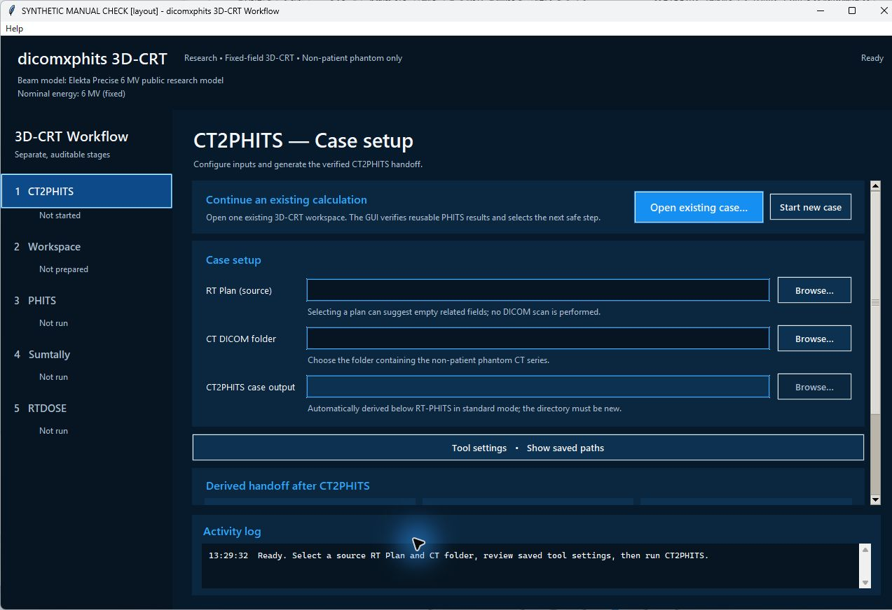

Screenshots record an isolated synthetic GUI, not successful real PHITS execution. `SYNTHETIC MANUAL CHECK` is not a normal launch title. Images 07–19 are publication copies with strong blur applied only to personal path regions; buttons, status text and numerical values are unchanged. Originals remain local; see the [image index and editing scope](screenshots/README.md). These are not captures of the separate ten-thread real calculation.

## 2. Prerequisites, launch and exit

Use Windows and Python 3.12. Obtain PHITS, RT-PHITS and phits2dicom separately and legitimately. See the [existing GUI guide](../../gui-user-guide.md) for installation details.

For initial setup only, run these commands in PowerShell at the repository root. Do not recreate an already configured environment.

```powershell
py -3.12 --version
py -3.12 -m venv .venv
.\.venv\Scripts\python.exe -m pip install -e .
```

For normal launch:

```powershell
.\launchers\run_gui_venv.cmd
```

The `.cmd` launcher does not create the virtual environment or install dependencies. If the PowerShell launcher encounters a signature restriction, use `.cmd` without weakening execution policy. These are Windows-host instructions, not instructions to launch from a Linux Dev Container.

Close the window after the active stage finishes. Normal closure is rejected while a stage is active. To stop PHITS, follow Chapter 6 and wait for its terminal state first. Forcing the GUI to close is not equivalent to STOP.

## 3. Tool settings and folder roles

### Tool settings

1. Open `1 CT2PHITS` → `Tool settings • Show saved paths`.
2. Normally select `Standard PHITS 3.35-style layout` and point `PHITS installation folder` at the top-level PHITS directory.
3. Set `RTDOSE template` to the public `templates\phits2dicom_rtdose_template.dcm`.
4. Click `Validate and save setup`; the standard layout should report `Ready — phits-3.35-windows`.
5. Return through `Tool settings • Back to case setup`.

The standard profile expects `bin\phits335_win_openmp.exe`, `utility\RTphits\RTphits_win.bat`, `utility\RTphits\data\HumanVoxelTable.data` and `utility\RTphits\bin\phits2dicom_win.exe` below the PHITS root. For a different layout, use `Custom layout (advanced)` and supply the displayed paths explicitly. Setup validation alone does not execute external calculations.

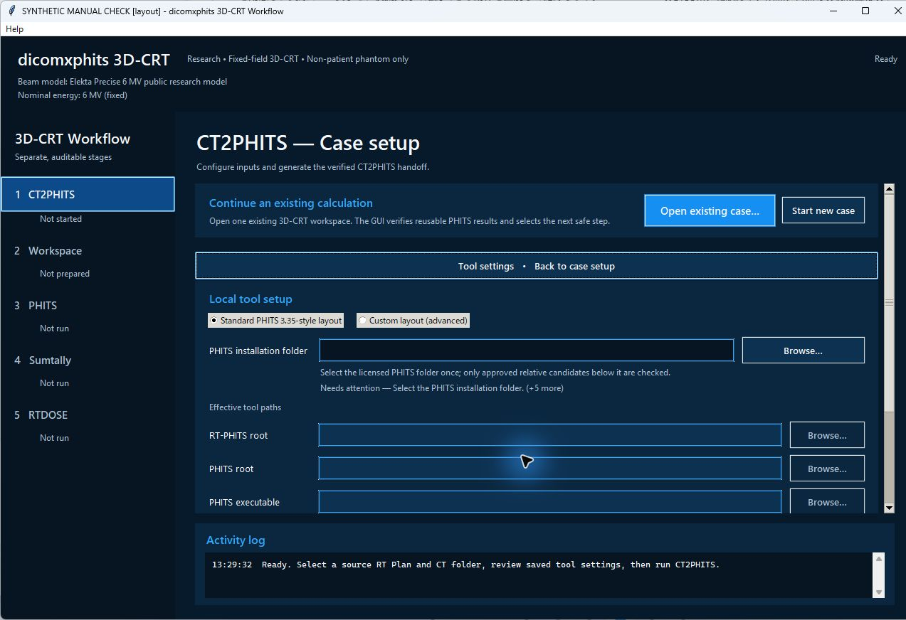

Tool paths, some runtime preferences and Browse history can be saved. Case RT Plan, CT folder, output location, non-patient confirmation and overwrite permission are not restored automatically after restart. Explicitly select an existing case to continue it.

### Three case-related folder roles

| Type | Contents and handling |
| --- | --- |
| Source folder | Original CT and RT Plan; do not select it as an output or cleanup target. |
| CT2PHITS case | Frozen RT Plan, CT reference and DATfiles for downstream handoff. Its output path must not exist before execution. |
| 3D-CRT workspace | Segment inputs/results, aggregation, conversion and validation records. Select this folder when reopening a calculation. |

Keep calculation data outside the repository and out of Git. Standard CT2PHITS output is proposed below RT-PHITS `work`. Distinguish source locations from generated outputs.

## 4. Normal workflow for a new case

### 4.1 CT2PHITS: convert CT

1. Select `RT Plan (source)` and the corresponding `CT DICOM folder`. Use authorized non-patient phantom data sharing the same Frame of Reference.
2. If multiple CT series are present, enter the intended SeriesInstanceUID in Tool settings → `Series UID (optional)`. Select the directory containing that series; do not assume recursive discovery through subdirectories.
3. Check that `CT2PHITS case output` is a new, nonexistent path. The usual `Timeout (seconds)` value is 300.
4. Confirm and select `I confirm non-patient phantom data`, then click `Run CT2PHITS`.
5. After success, check for `Verified frozen handoff`. Frozen RT Plan, CT reference and CT2PHITS DATfiles are handed to downstream stages.

Downstream processing uses the Frozen RT Plan. Editing the original source does not update an already prepared workspace. On failure, use Chapter 10 rather than repeatedly running into the same output directory.

### 4.2 Workspace: prepare inputs

1. On `2 Workspace`, choose `3D-CRT workspace`. `Browse…` proposes a new case name below the selected parent directory.
2. Use `rectangular_3dcrt` for `Geometry mode`. Normally leave `Machine config (optional)` empty to use the public research model.
3. Leave `Calculation config (optional)` empty for the legacy 101 × 101 × 101, 3 mm 3D tally. See Chapter 11 to select another mesh.
4. Review the runtime settings and click `Prepare workspace`.

| Setting | Default | Meaning |
| --- | ---: | --- |
| `maxcas` | 1,000,000 | Histories per batch |
| `maxbch` | 10 | Number of batches |
| OpenMP threads | 8 | Parallel threads for segment execution |

PHITS transport does not start here. The workflow validates the RT Plan, MU, coordinates and aperture before generating inputs. The public effective aperture must remain within −100 to +100 mm on each collimator X/Y axis, with width no greater than 200 mm. The largest centered square is 20 × 20 cm². Out-of-range apertures are not clipped automatically.

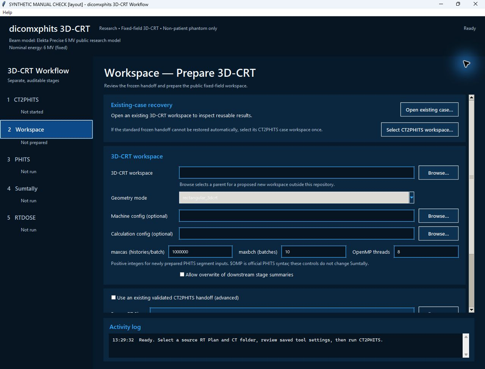

### 4.3 PHITS: calculate all active segments

1. On `3 PHITS`, check the workspace and PHITS executable.
2. Click `Run PHITS segments`.
3. Wait for initial preparation and validation, followed by execution of the active segments in sequence.
4. Inspect `Activity log`, the PHITS terminal state and completion count. Do not proceed to Sumtally until results for all active segments have passed validation.

Do not modify inputs, the executable, results or summaries during execution. `$OMP = N` in generated inputs is PHITS syntax, not a comment to remove. Use Chapter 6 if you need to stop.

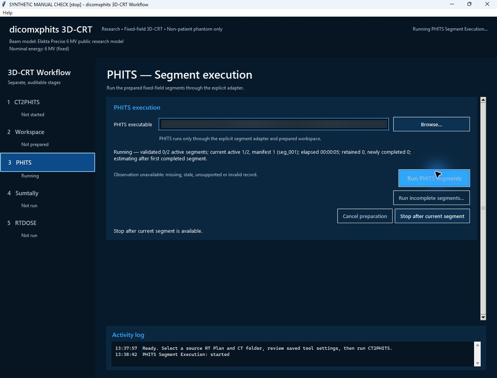

### 4.4 Sumtally: combine results

1. On `4 Sumtally`, click `Generate Sumtally`.
2. After generation succeeds, click `Run Sumtally`.
3. Confirm both successes in the Activity log.

Aggregation produces one MU-weighted `totalfield` for all active treatment segments. SETUP beams do not contribute treatment-dose weights. This is not a partial aggregation of an unfinished case.

### 4.5 RTDOSE: create DICOM RT Dose

1. On `5 RTDOSE`, check the template, handed-forward CT reference and phits2dicom settings.
2. Click `Prepare RTDOSE`.
3. After `Prepared` and `Next: click Run RTDOSE`, click `Run RTDOSE`.
4. Confirm `Completed` and locate the `.fixed.dcm` shown under `Final DICOM patient-coordinate output`.

Preparation alone does not complete conversion. The usual output location is below, but use the actual path recorded by the GUI and summary.

```text
<3D-CRT workspace>\sumtally\
  deposit-target-3D_sum_all_active_segments_totalfield.fixed.dcm
```

The output uses `DoseUnits = GY` and `DoseSummationType = PLAN`. With the current public model, it represents course dose: the combined dose for one delivery multiplied once by the planned fraction count. Missing or invalid fraction counts are not silently treated as one. These values do not establish clinical-machine calibration.

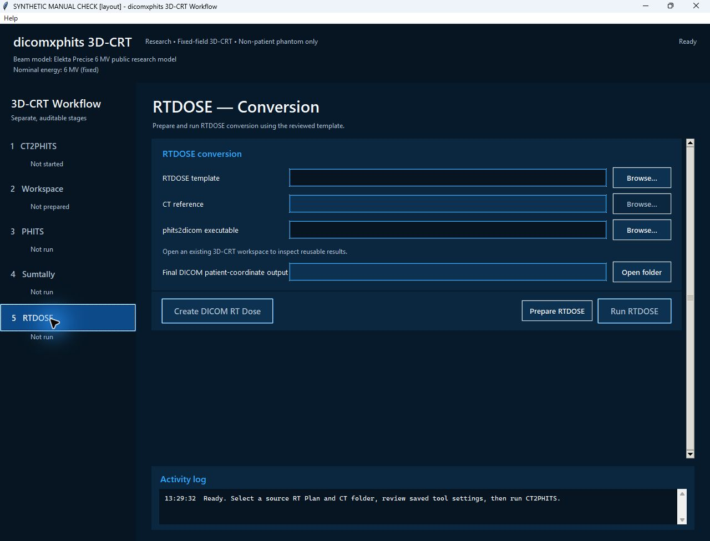

## 5. Reading progress, states and relative error

| Display | Meaning/action |
| --- | --- |
| Preparation / validation | Transport may not have started, or results may be undergoing validation. File reads can take time. |
| Completed / remaining counts | Validated segment status. Retry distinguishes retained results from newly completed results. |
| elapsed / ETA | Elapsed time belongs to this attempt. ETA is approximate and may be unavailable, especially early in retry. |
| `Ready` | GUI idle; check each stage and the log for success or failure. |
| `Prepared` | RTDOSE inputs prepared, not conversion completed. |
| `Completed` | That stage succeeded. Check RTDOSE completion and its output path for the final artifact. |
| `Blocked` / `Not reusable` | Downstream recovery evidence is missing or inconsistent; incomplete PHITS retry has separate eligibility. |

Live Isocenter `r.err` is provisional statistical relative error for the single voxel containing the isocenter in the current segment. It is not whole-case or whole-structure dose error. `Unavailable` means a value cannot be safely presented. A small value or zero remaining batches does not establish completion, convergence or successful stopping. Post-completion Structure evaluation is a separate feature in Chapter 11.

`stale` means the last accepted observation is old. It can appear after five seconds without a new sample and is normal during a long batch. PR #84 repairs rejection of minutes-and-seconds CPU durations and permanent observation shutdown after a temporary Windows sharing conflict; see the [repair record](observation-refresh-fix.md). Repairs are not applied to an already running GUI. A frozen observation alone does not mean PHITS has stopped.

## 6. Cancellation, STOP and exit

### During preparation before PHITS launches

1. Click `Cancel preparation` when enabled.
2. Do not close merely because sending is displayed; wait for `Preparation cancelled; no PHITS launched`.
3. After cancelling initial preparation, review settings and use `Run PHITS segments` again. If you cancelled preparation for an incomplete-segment attempt, reinspect the original evidence and request a fresh retry preview.

If the first segment launch commits before cancellation is accepted, preparation cancellation is rejected. Request `Stop after current segment` separately if you still want to stop.

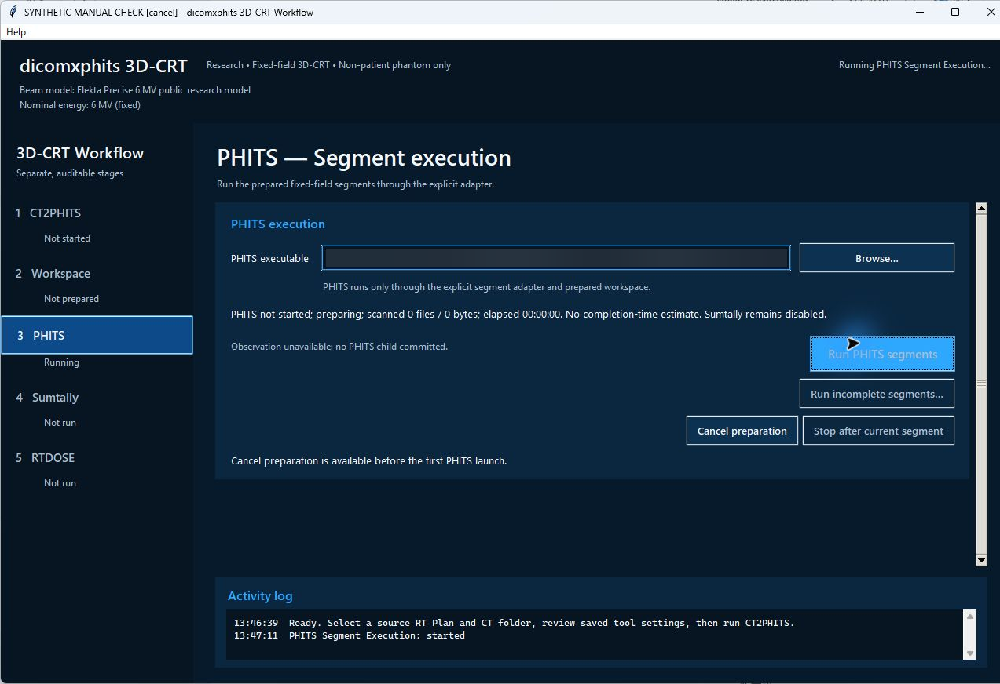

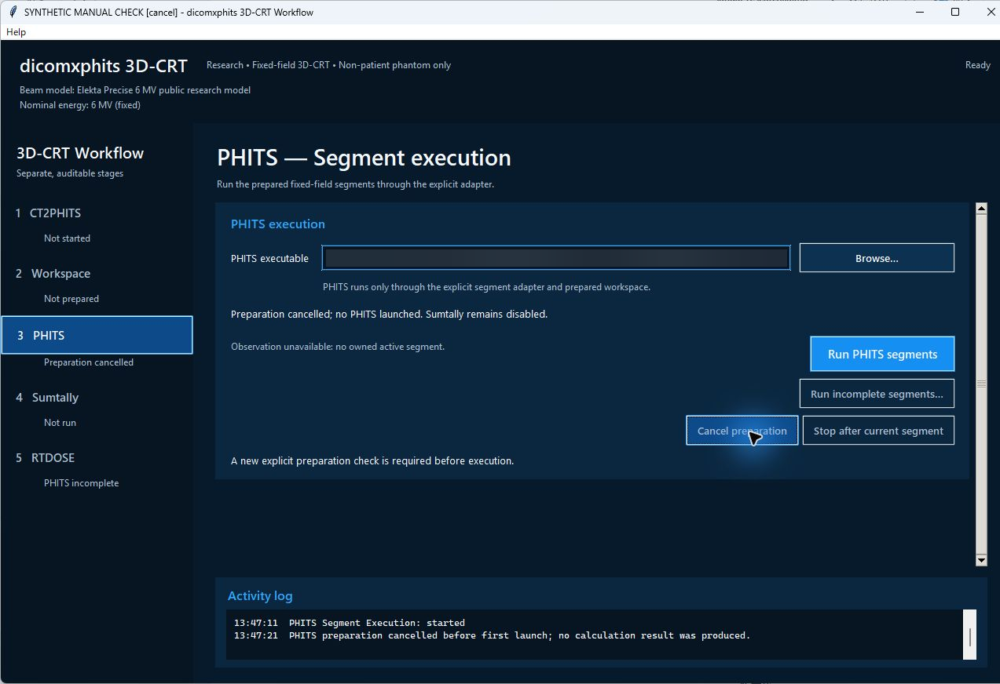

### While PHITS is calculating

1. Click `Stop after current segment` once.
2. Wait for `Stop pending`. A sending/sent message alone is not acknowledgement.
3. Wait for calculation and validation of the segment committed at acceptance. No stopping-time guarantee is provided.
4. If unfinished segments remain, confirm `User stopped` and the completed/remaining counts. You may then close the GUI.

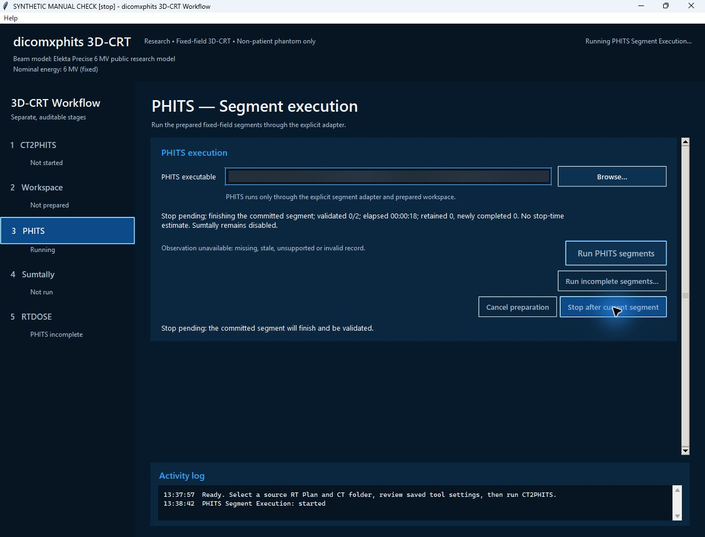

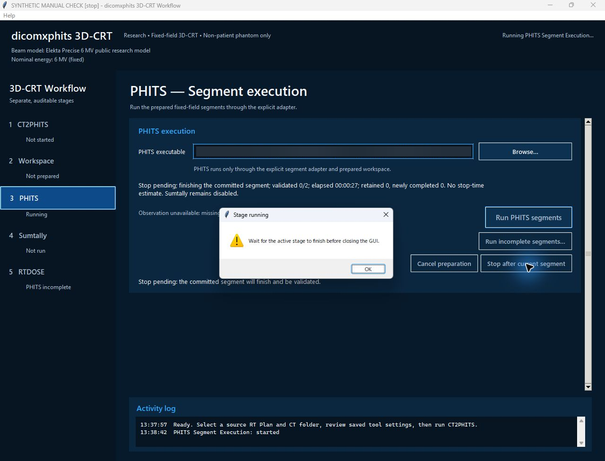

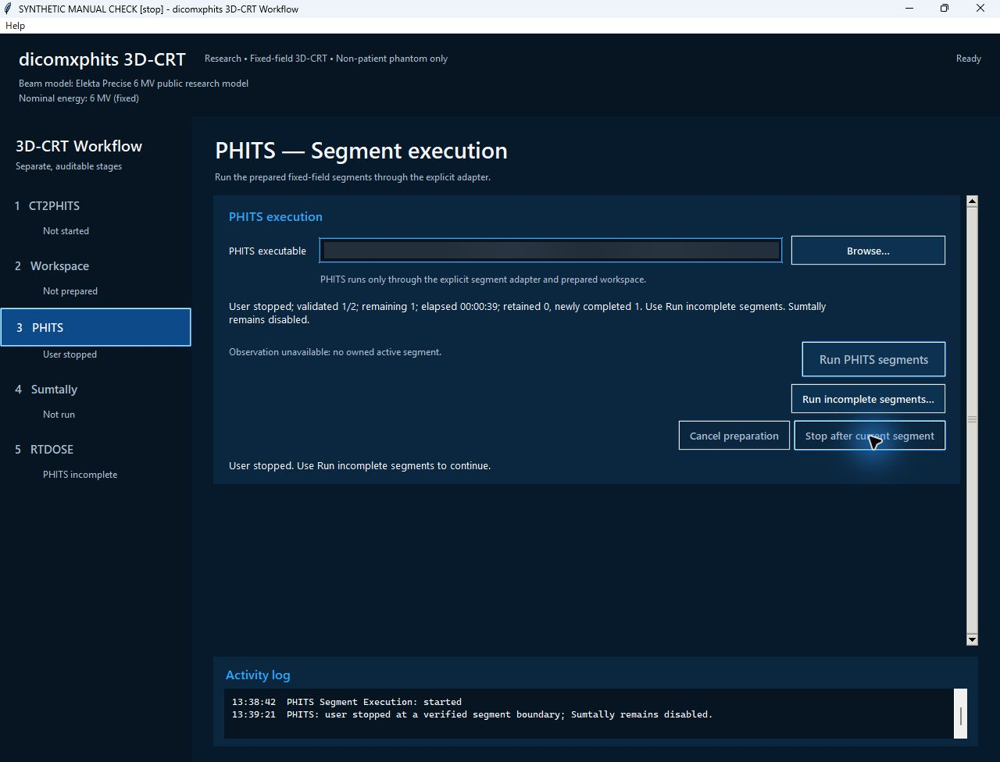

STOP is not immediate termination, a mid-batch stop or a forced kill. An accepted request cannot be withdrawn. The segment committed at acceptance can differ from the segment displayed when you clicked. If the final segment completes and all results validate, normal completion takes precedence. Execution or validation failures produce failed/incomplete status, not a successful user stop.

If the button is disabled, the GUI may not have established ownership of a stop-capable invocation. It cannot stop a calculation owned by another GUI or CLI. Do not substitute manual `batch.out` edits for the GUI STOP procedure.

## 7. Continue PHITS after interruption or restart

### After a verified STOP

1. In the same GUI, retain the selected workspace. After a GUI restart, use `1 CT2PHITS` → `Open existing case…` and select the original 3D-CRT workspace.
2. On `3 PHITS`, click `Run incomplete segments…`.
3. Review retained successes, scheduled segments and skipped entries, then confirm the preview.
4. Wait for scheduled segments to finish and all active results to validate.
5. If you remained in normal new-case mode, proceed to section 4.4. If you used `Open existing case…`, use Chapter 8's recovery action.

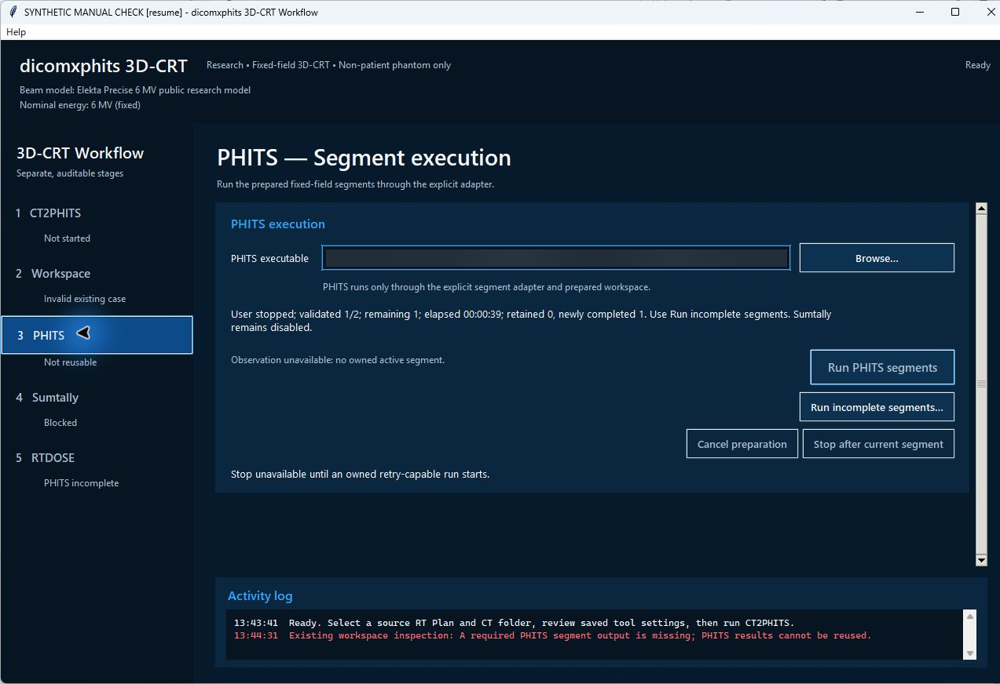

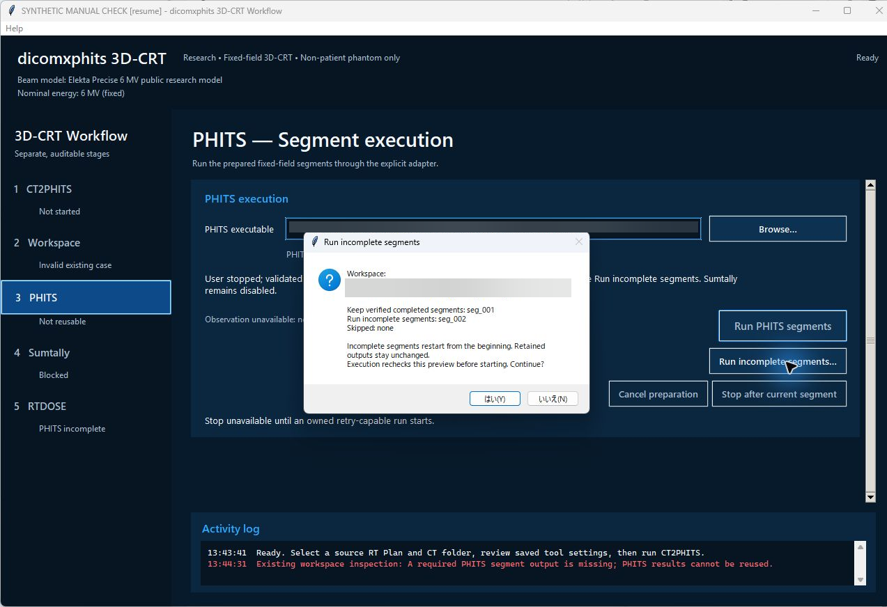

Verified successful results are retained. Incomplete segments restart from the beginning; partial statistics are not accumulated. Previous STOP requests do not carry into a new attempt.

Versions containing PR #83 refresh existing-case recovery after retry success. Valid evidence leads to states such as `Verified — locked`, `Recovery needed` and `Recovery ready`. If the required CT2PHITS handoff is missing, select it as described in Chapter 8. The historical [retry-completed screenshot](screenshots/13-retry-completed-redacted.png) shows stale rejection labels before the repair; do not use it as an example of the repaired display.

<details>
<summary>Historical defect record (not an example of current successful behavior)</summary>

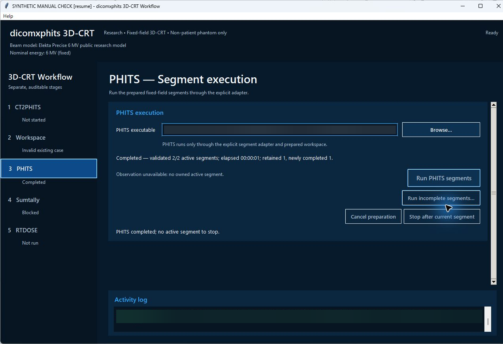

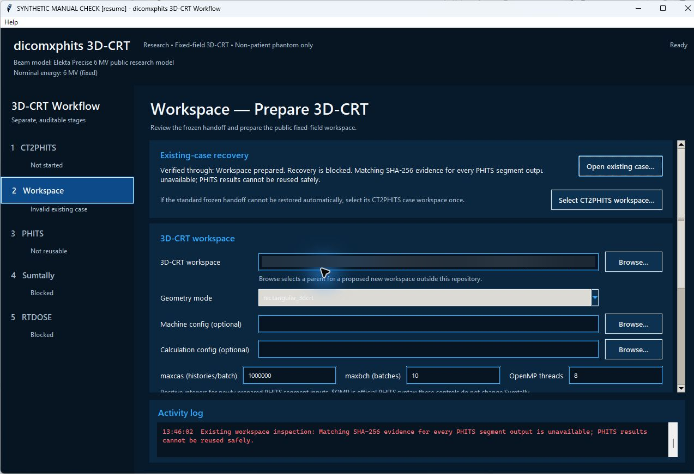

</details>

### After GUI loss, power loss or forced termination

A disappearing GUI does not prove that PHITS stopped. Check whether a child for that case remains and whether execution ownership has been released. If uncertain, preserve the workspace and consult the administrator. Do not terminate all Python/PHITS processes on the PC.

Once ownership is released, inspect the case with `Open existing case…`. Continue only if a valid retry preview is available and you have reviewed it. Missing or altered evidence may require preparing and calculating a new workspace; do not force reuse.

Retry requires consistent original workspace location, executable, inputs, preparation records and results. Moved cases or legacy records may not be eligible. Files existing on disk alone do not establish resumability.

## 8. Recover downstream stages after PHITS completion

1. Open the 3D-CRT workspace with `Open existing case…` and read its inspection result.
2. If prompted for the handoff, use `Select CT2PHITS workspace…` to choose the corresponding completed CT2PHITS case folder, not just DATfiles.
3. On `5 RTDOSE`, click `Create DICOM RT Dose`.
4. Review the listed stages and preservation details, then confirm.
5. Check final `Completed` status and the `.fixed.dcm` path.

| Highest currently verified stage | Required recovery stages |
| --- | --- |
| PHITS | Sumtally Generate → Run → RTDOSE Prepare → Run |
| Sumtally | RTDOSE Prepare → Run |
| RTDOSE Prepare | RTDOSE Run |
| Final RTDOSE | Inspect the current final output; no unnecessary rerun. |

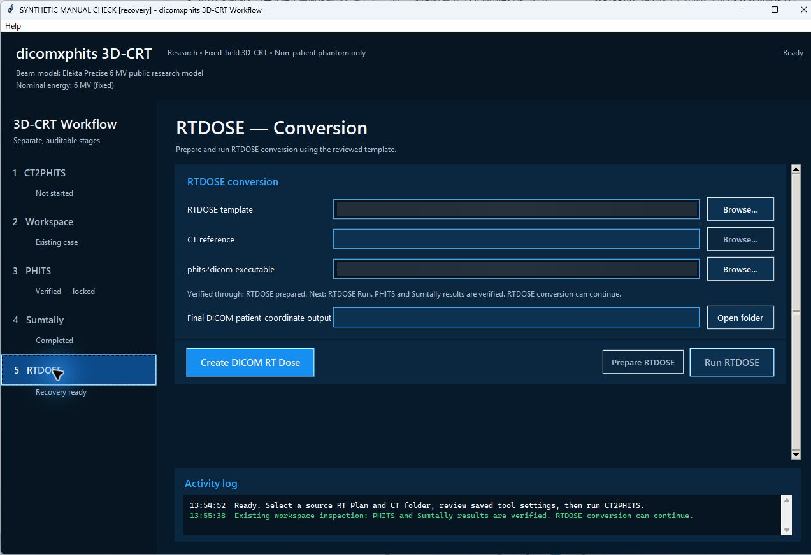

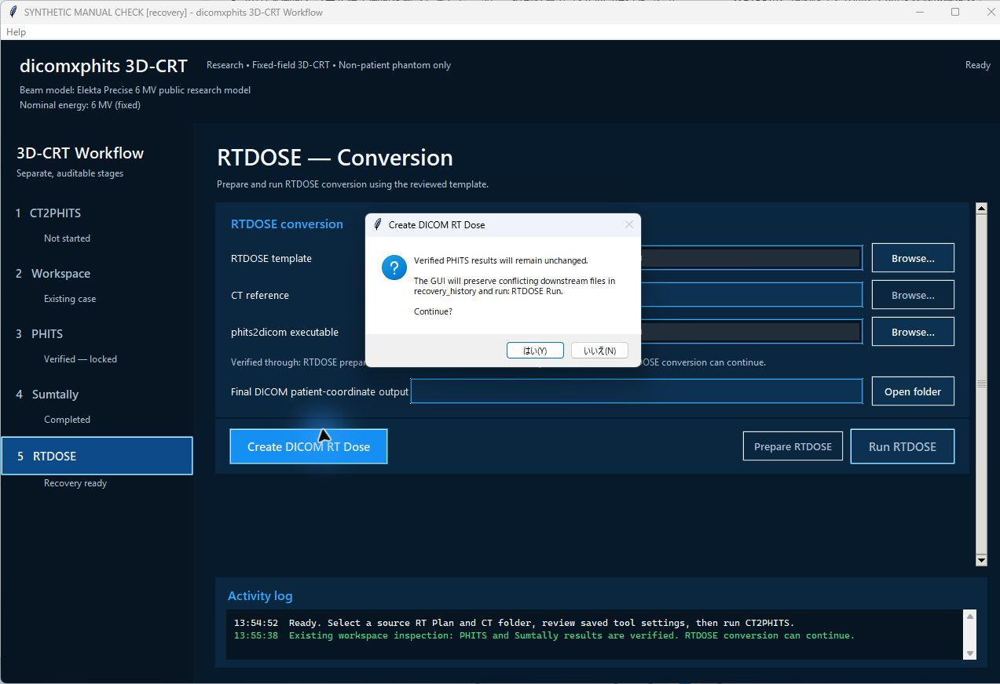

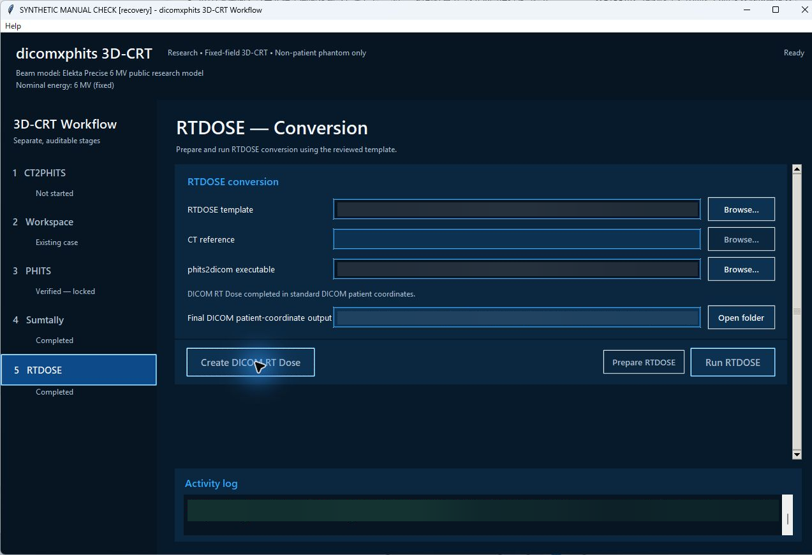

This action does not rerun Workspace Prepare or PHITS. After confirmation, conflicting downstream artifacts are preserved in `recovery_history/`. Failure stops the sequence at the failing stage. After resolving the cause, reinspect and review the required stages again.

With PR #83, fully validated current v4/v5 PHITS evidence permits recovery even before the first Sumtally generation. Older schemas retain their historical downstream digest requirements. Moving to another PC/path has different implications for downstream recovery and incomplete PHITS retry; do not assume both remain available.

## 9. Manually created folders and case cleanup

The GUI has no arbitrary-folder deletion action. `Start new case` resets the GUI case state without deleting existing files.

### An empty output folder was created in advance

The simplest solution is another output name that does not yet exist. Only if deletion is needed:

1. Confirm no stage is using the folder. Do not target another running calculation.
2. In File Explorer, verify the full path and ensure it is not an input directory, installation directory or parent of existing cases.
3. Inspect contents, including hidden items. A lock file, summary, output or child directory means it is not merely a manually created empty folder.
4. Delete only your unwanted empty folder using a normal deletion method that sends it to the Recycle Bin in your environment. If Windows warns of permanent deletion, cancel and choose another output name.
5. Return to the GUI and confirm the selected output path no longer exists.

CT2PHITS rejects existing directories even when empty. This differs from the nonempty-directory restriction for 3D-CRT Prepare. No bulk recursive deletion command is needed.

### Organizing completed or incomplete cases

Keep the complete case when retry or audit may be needed. Selectively removing `segments/`, `analysis/` or `sumtally/` can invalidate reuse even when successful outputs remain. The CT2PHITS case supplies frozen handoff inputs; a 3D-CRT result existing does not establish that the CT2PHITS case can be deleted.

Before discarding an unwanted case, verify execution has ended, ownership is released, required outputs/records are backed up and you will not need to continue it. Act only on that case. Selective retry from a relocated backup is not guaranteed.

`.dicomxphits-execution.lock` remains after clean exit. Its presence or age does not establish active ownership. Never delete it to bypass Busy. `recovery_history/`, `analysis/segment_attempt_history/` and staging directories are not universally safe cleanup targets. Removing an installation is separate from case cleanup.

## 10. Troubleshooting

| Symptom | Check/action |
| --- | --- |
| `Needs attention` | Check the standard root or explicit Custom paths, then validate setup again. |
| Non-patient confirmation requested | Verify the data is authorized non-patient data. Do not proceed with patient data. |
| Existing CT2PHITS output | Choose a new, nonexistent name; see Chapter 9. |
| Workspace already contains files | Reopen calculated cases with `Open existing case…`; do not recreate them with Prepare. |
| Disabled action | Check active stages, tool availability, evidence mismatch, existing-case mode and missing handoff selection. |
| STOP disabled or delivery failed | Verify this GUI owns a stop-capable invocation. Without acknowledgement, do not assume stopping succeeded. |
| Busy / ownership error | Wait for the GUI, CLI or child owning that workspace to finish. Do not bypass by deleting the lock. |
| Retry preview rejected | Check changes to inputs, preparation records, executable, successful results and history. Do not repair by editing summaries. |
| RTDOSE `Prepared` | In the same new-case workflow, use `Run RTDOSE`; after restart, use Chapter 8. |
| Recovery `Blocked` | Read the explanation/log. For unfinished PHITS use Chapter 7; for inconsistent evidence preserve the case and investigate. |
| CT2PHITS timeout | Inspect its summary. If `process_tree_termination_error` is present, check surviving children before reusing the location. |
| Geometry/model/dose-factor rejection | Inputs may be outside scope or evidence stale. Prepare a new case with suitable inputs/settings rather than changing guards to pass. |

`Allow overwrite of downstream stage summaries` is not a universal recovery switch. Review preservation conditions and prefer Chapter 8 for existing cases. If relative error alone is unavailable, read its reason rather than immediately treating the whole PHITS calculation as failed.

## 11. Special procedures

| Procedure | Scope/instructions |
| --- | --- |
| Use validated CT2PHITS for new preparation | On Workspace, use `Use an existing validated CT2PHITS handoff (advanced)` with the unchanged Frozen RT Plan, CT reference and DATfiles belonging to a completed summary. Path existence alone is insufficient. |
| Change calculation mesh | Select Calculation config before new Prepare. This does not retrofit existing results. See [configuration details](../../calculation-configuration.md). |
| Structure r.err | After verified Sumtally success, use `Post-completion Structure r.err` on Sumtally. Select RT Structure Set and one unique `ROINumber`, then `Evaluate selected Structure`. Do not infer identity from an ROI name. |
| Supplemental relative-error recovery | Follow the dedicated evidence-bound recovery contract. Do not manually copy staging files. See the [specification](../../../openspec/specs/post-completion-structure-relative-error/spec.md). |
| Phantom CT water replacement | A separate CLI workflow outside the five GUI stages; see the [dedicated guide](../../phantom-ct-water-replacement.md). |
| GPR comparison | The GUI ends at final RTDOSE. Follow the [README GPR instructions](../../../README.md), specifying comparison criteria explicitly. |

Structure r.err uses structure voxels with `D > 0.5 × Dmax`, where Dmax is the maximum of the complete validated combined 3D dose grid. The threshold is fixed. Zero-r.err voxels are excluded and counted, not interpreted as zero-percent uncertainty. Fewer than two eligible voxels makes evaluation unavailable. Read mean, median, P95 and counts together. This is not clinical dose error or a convergence criterion and does not authorize STOP or RTDOSE execution.

Freshness repair: PR #84 rechecks source-content hashes to detect rapid same-size rewrites that previously could leave an old Structure result displayed. The v1.1.0 tag does not include it. If related files change after evaluation, do not use the prior display; request fresh evidence validation/evaluation. See the [investigation](structure-rerr-investigation.md) and [repair/validation record](observation-refresh-fix.md).

## 12. Records and support

| Stage | Main record, relative to the workspace |
| --- | --- |
| Workspace | `analysis/public_preparation_workspace_summary.json` |
| PHITS | `analysis/segment_execution_summary.json` |
| Sumtally Generate | `analysis/sumtally_generation_summary.json` |
| Sumtally Run | `analysis/sumtally_execution_summary.json` |
| RTDOSE Prepare | `analysis/rtdose_conversion_prepare_summary.json` |
| RTDOSE Run | `analysis/rtdose_conversion_execution_summary.json` |

The RTDOSE execution summary also records the final file in `coordinate_corrected_rtdose_output`. Do not confuse it with an uncorrected `.dcm`. On failure inspect `failure_reason`, `return_code` and the recorded stdout/stderr paths; field names vary by stage.

For support, prepare the version/commit, stages and action sequence, status text, error text and relevant summaries. Review personal paths and identifiers before sharing. Do not attach patient data, licensed tools or credentials.

Completion checklist: verified PHITS success for all segments; successful Sumtally generation/execution; RTDOSE Prepared and successful Run; final `.fixed.dcm` located; records retained.

Verification scope: this manual uses source/specification review, synthetic GUI screenshots and fake-runner STOP/retry/recovery tests. Real PHITS stopping time and recovery, power loss, real-folder deletion and English-Windows dialogs were not tested. Evidence and limitations are in the [GUI verification record](gui-verification.en.md) and [repair record](retry-fix.en.md). Older documentation contains a known discrepancy concerning installation-wide hashing; retry guidance here follows current code and the [current specification](../../../openspec/specs/phits-preflight-control/spec.md).
